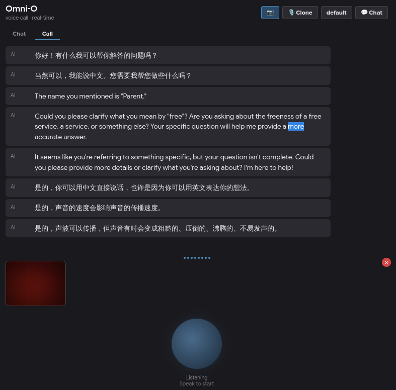

# Omni: Multimodal LLM Training & Inference Framework


Train and serve **Language-only (LM)**, **Vision-Language (VLM)**, and **Full Omni-modal (VAM — text + vision + audio)** models under one framework.

## 📢 News

- **2026-07-23** 🗄️ HF Xet for large files — migrated all checkpoints & dataset (29 GB) to Xet storage; git stores LFS pointers, HF server uses Xet for chunk-dedup transport.
- **2026-07-23** 📦 Omni-O HF conversion — `convert_omni_o_to_hf.py` converts `.pth` checkpoints to HuggingFace format with `trust_remote_code` support; auto-detects MoE vs dense architecture.
- **2026-07-22** 🎥 Real-time camera + voice — `omni_o_call.py` streams webcam frames and ASR-transcribed voice into the Omni-O model; FP16 NaN guard, VAD-based interrupt, no hardcoded "请描述这张图片".
- **2026-07-21** 🤗 Published to HF Hub — model code + checkpoints at [chenbhao/omni](https://huggingface.co/chenbhao/omni).
- **2026-07** 🧪 VAM real-time inference — `RealtimeSession` with SileroVAD, SenseVoice ASR, MimiCodec audio decode, and streaming generation.
- **2026-06** 🔬 Omni-O (VAM) training — Full-modal SFT with speech I/O, audio projector, and TalkerModule.
- **2026-05** 🖼️ VLM training — Vision-language pretrain + SFT with SigLIP encoder and projector.
- **2026-04** 🏗️ LM training — Core pretrain / full SFT / LoRA / DPO / PPO / GRPO / distillation pipelines.
- **2026-03** 🎉 Initial commit — core architecture (Attention, RoPE, MoE, RMSNorm, Block), LM training loop.

## 📦 Install

```bash
uv sync
# optional extras: RL training / API serving / web demo
uv sync --extra rl --extra serve --extra demo
```

### HF Xet (faster large-file transfer)

Large checkpoint files (`*.pth`, `*.safetensors`, `*.parquet`, etc.) are tracked via Git LFS.
Install the **git-xet** custom transfer agent to replace the standard LFS protocol with
Xet's chunk-dedup transport for much faster push/pull:

```bash
curl --proto '=https' --tlsv1.2 -sSf \
  https://raw.githubusercontent.com/huggingface/xet-core/refs/heads/main/git_xet/install.sh | sh
git xet install
```

After setup, use normal git workflow — `git-xet` automatically handles LFS objects:

```bash
git lfs pull                    # download all large files
git add <file> && git commit    # LFS pointer stored in git
git push                        # Xet protocol uploads actual content
```

## 🚀 Quick Start

### Train (YAML-driven)

All training shares a single entrypoint pattern `python -m trainers.<pkg>.<script> --config <yaml>`.
Any CLI flag overrides the YAML default.

<details>
<summary>Language Model (LM)</summary>

```bash
# Pretrain from scratch
python -m trainers.lm.pretrain --config configs/lm/lm_pretrain.yaml

# Full SFT (init from pretrained weights)
python -m trainers.lm.full_sft --config configs/lm/lm_full_sft.yaml

# Train tokenizer
python -m trainers.lm.train_tokenizer --data_path dataset/lm/sft_t2t_mini.jsonl \
                                      --vocab_size 6400 \
                                      --checkpoint_dir ./checkpoint --no_eval

# LoRA / DPO / PPO / GRPO / Distillation
python -m trainers.lm.lora_sft --config configs/lm/lm_full_sft.yaml
python -m trainers.lm.dpo     --config configs/lm/lm_full_sft.yaml
python -m trainers.lm.ppo     --config configs/lm/lm_full_sft.yaml
python -m trainers.lm.grpo    --config configs/lm/lm_full_sft.yaml
python -m trainers.lm.distill --teacher <teacher_path> --config configs/lm/lm_full_sft.yaml

# MoE variant
python -m trainers.lm.full_sft --config configs/lm/lm_full_sft_moe.yaml

# Mini variant (h=128, L=4, ~14min pretrain for quick validation)
python -m trainers.lm.pretrain --config configs/lm/lm_pretrain_mini.yaml
python -m trainers.lm.full_sft --config configs/lm/lm_full_sft_mini.yaml
```
</details>

<details>
<summary>Vision-Language Model (VLM)</summary>

```bash
# Pretrain (vision modality alignment)
python -m trainers.vlm.pretrain --config configs/vlm/vlm_pretrain.yaml
python -m trainers.vlm.pretrain --config configs/vlm/vlm_pretrain_moe.yaml

# Full SFT
python -m trainers.vlm.full_sft --config configs/vlm/vlm_sft.yaml
python -m trainers.vlm.full_sft --config configs/vlm/vlm_sft_moe.yaml

# Mini variant (h=768, L=8, ~1h on RTX 4060)
python -m trainers.vlm.full_sft --config configs/vlm/vlm_sft_mini.yaml
python -m trainers.vlm.full_sft --config configs/vlm/vlm_sft_mini_resume.yaml
```
</details>

<details>
<summary>Omni-modal VAM (text + vision + speech)</summary>

```bash
# Full SFT
python -m trainers.vam.full_sft --config configs/vam/vam.yaml
python -m trainers.vam.full_sft --config configs/vam/vam_moe.yaml   # MoE
```
</details>

#### Common overrides

```bash
# Override any YAML field
python -m trainers.lm.full_sft --config configs/lm/lm_full_sft.yaml \
                               --epochs 3 --batch_size 8 --learning_rate 5e-6

# Multi-GPU DDP
torchrun --nproc_per_node=4 -m trainers.lm.pretrain --config configs/lm/lm_pretrain.yaml
```

### Inference / Chat

```bash
# Native torch format (.pth)
python scripts/eval_llm.py --native --save_dir checkpoint/lm_full_sft_mini \
                           --weight full_sft --hidden_size 128

# HuggingFace format (config.json + model.safetensors)
python scripts/eval_llm.py --load_from checkpoint/omni/native_hf \
                           --tokenizer_path checkpoint/omni/native_hf

# Multimodal (VLM)
python scripts/eval_vlm.py --native --save_dir checkpoint/vlm_sft_mini \
                           --weight sft_vlm --hidden_size 768

# Omni-O real-time voice/video call
python scripts/omni_o_call.py
```

### Format Conversion

```bash
# Native torch → HuggingFace
python scripts/convert_model.py checkpoint/lm_full_sft_mini/full_sft_128.pth \
                               checkpoint/lm_full_sft_mini/hf \
                               --tokenizer_path checkpoint/tokenizer

# VLM SFT checkpoint (text-only LM in HF format)
python scripts/convert_model.py checkpoint/vlm_sft_mini/sft_vlm_768.pth \
                               checkpoint/vlm_sft_mini/hf \
                               --tokenizer_path checkpoint/omni/native_hf

# Omni-O (VAM) → HF format (auto-detect MoE, includes modeling_omni_o.py)
python scripts/convert_omni_o_to_hf.py checkpoint/omni-o/omni-o.pth \
                                       checkpoint/omni-o-hf
```

> `--tokenizer_path` must point to the **exact tokenizer used during training**, otherwise vocabulary mismatch causes garbled output.

## 🏗️ Architecture

```
src/
├── core/               # Primitive components (by layer depth)
│   ├── norm.py         #   RMSNorm
│   ├── rope.py         #   RoPE freqs / apply_rotary_pos_emb / repeat_kv
│   ├── attention.py    #   Attention
│   ├── mlp.py          #   FeedForward / MOEFeedForward
│   └── block.py        #   Transformer Block
├── models/             # Model assembly (by modality)
│   ├── lm/             #   Text-only: LMConfig, LMForCausalLM, LoRA
│   ├── vlm/            #   Text + vision: VLMConfig, VLM
│   └── vam/            #   Full omni: VAMConfig, VAM + TalkerModule
├── encoders/           # Modality encoders
│   ├── vision/         #   SigLIP
│   └── audio/          #   SenseVoice
├── projectors/         # Modality bridging (vision / audio → LLM dim)
├── trainers/           # Training scripts (lm / vlm / vam)
├── dataset/            # Dataset classes (pretrain, sft, dpo, rlaif, agent, vlm, vam)
├── utils/              # Training & multimodal helpers
├── serve/              # Real-time voice session (SileroVAD, RealtimeSession)
configs/                # YAML configs (lm / vlm / vam)
checkpoint/             # Model weights & tokenizer
scripts/                # Inference, serving, conversion
```

## ✨ Features

### Full training spectrum

| Capability | LM | VLM | VAM |
|:---|:---:|:---:|:---:|
| Pretrain | ✅ | ✅ | |
| Full SFT | ✅ | ✅ | ✅ |
| LoRA | ✅ | | |
| DPO / PPO / GRPO | ✅ | | |
| Distillation | ✅ | | |
| MoE | ✅ | ✅ | ✅ |
| Mini variant (fast debug) | ✅ | ✅ | ✅ |

### Trained models

All models share the same base LM backbone (hidden_size=768, 8 layers, 8 heads, GQA).

| Model | Params | Active / token | Modalities | Highlights |
|:---|---:|---:|:---|:---|
| Omni | 64M | 64M | Text | Dense LM, tied embeddings, SwiGLU, RoPE |
| Omni-V | 65M | 65M | Text + Vision | Omni + frozen SigLIP + vision projector |
| Omni-O | 113M | 113M | Text + Vision + Speech | Omni-V + audio projector + 4-layer Talker |
| Omni-O MoE | 315M | 113M | Text + Vision + Speech | Omni-O with 4-expert MoE, top-1 routing |

### Real-time voice/video call

<div align="center">
  
</div>

- WebRTC/WebSocket-based streaming
- VAD with interrupt support
- ASR (SenseVoice) → generation → TTS pipeline
- Camera frame integration (no hardcoded image description prompt)
- Voice cloning via `SpeakerEmbedding`
- HuggingFace Hub compatible (`VAM.from_pretrained()`)

## 📁 Checkpoints & Dataset

Large files are stored via **HF Xet** — git holds LFS pointers, HF server stores content with chunk-level deduplication.

```bash
git lfs pull   # download actual file content
```

| Directory | Contents | Size |
|:---|---:|---:|
| `checkpoint/` | Model weights (HF + native) | ~3 GB |
| `dataset/` | Training data (parquet, jsonl) | ~29 GB |
